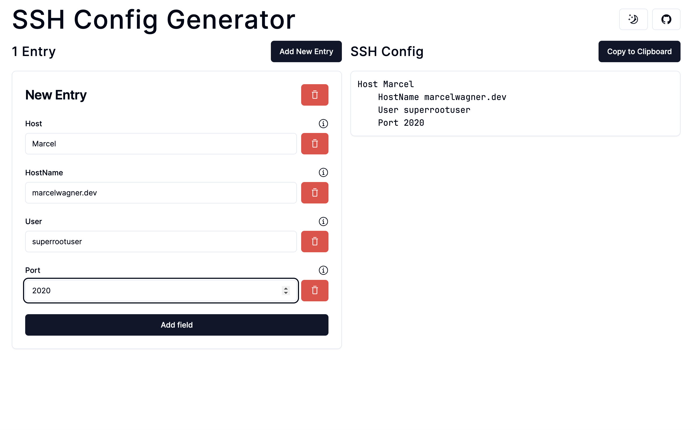
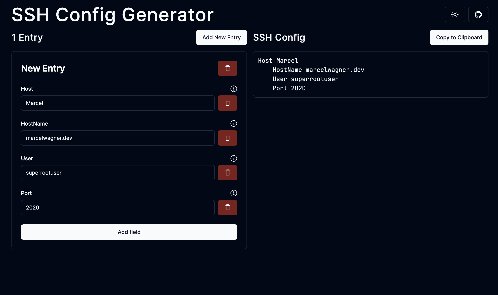
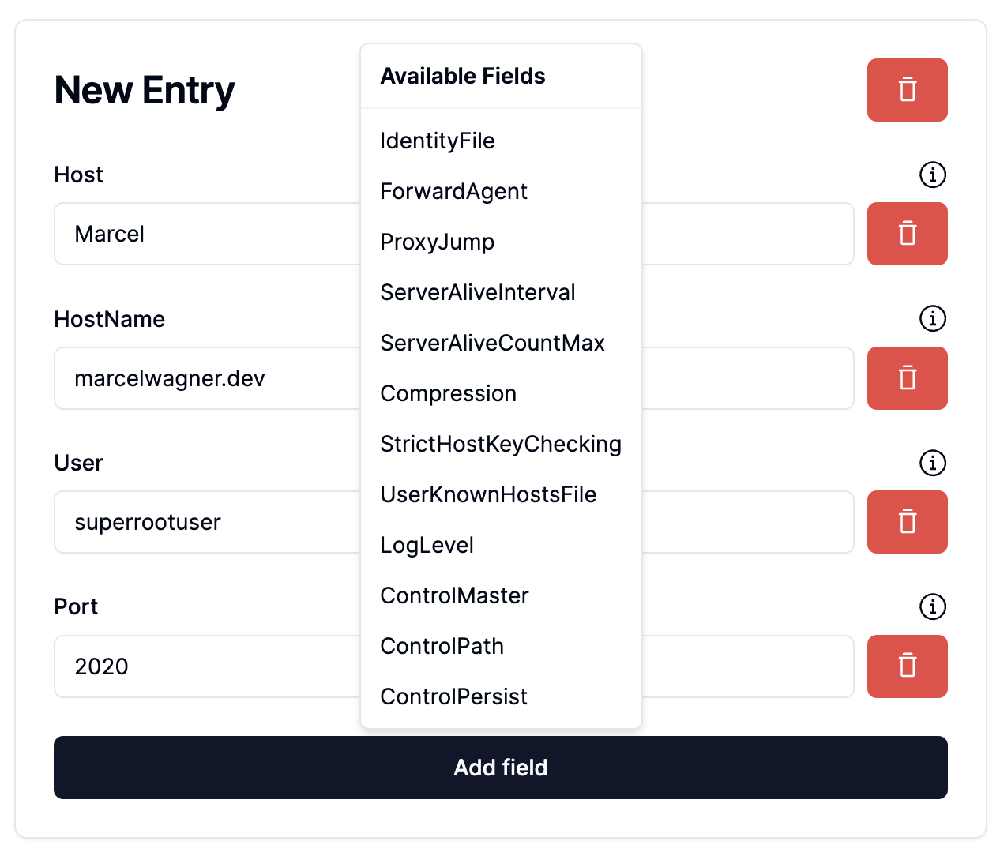

# SSH Config Generator

Minimalistic SSH config generator for multiple servers with fancy User Interface.

## Live Demo

[https://sshconfig.marcelwagner.dev](https://sshconfig.marcelwagner.dev)

## Features

- Add, edit, delete servers
- Generate SSH config file
- Copy SSH config file to clipboard

## Screenshots

### Light Mode

### Dark Mode

### Select Fields

## LICENSE
This project is licensed under the AGPLv3 License - see the [LICENSE](LICENSE) file for details
